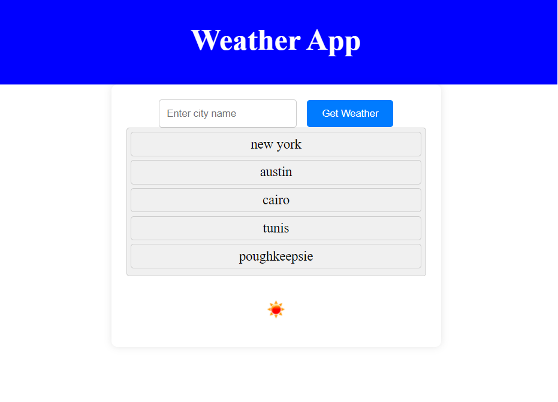
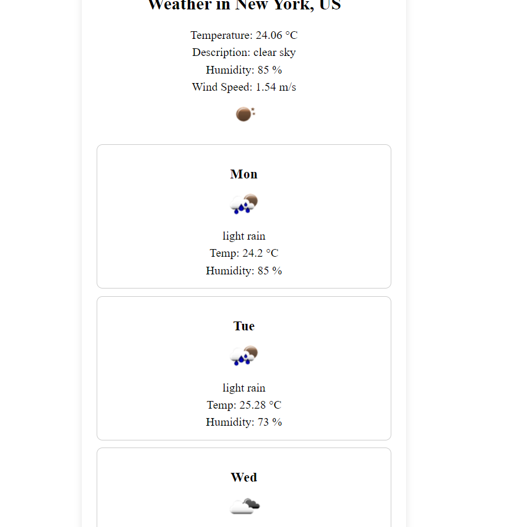

# weather-dashboard
# 

## Description
This webpage is a weather application that displays the current weather and 5 day forecast for any city globally.  The current weather will display the temperature, sky description, humidity percentage, and wind speed.  The forecast displays sky conditions, temperature, and humidity. 

## Installing
N/a

## Usage
The landing page of the weather application will open with a search bar, search history, and sun icon.  Type any city globally in order to get the current weather and five day forecast.  

Once the webpage is closed and reopened, the landing page should display your previous 8 city searches.

## Screenshot 

## URL
https://chrisreynolds0508.github.io/weather-dashboard/

## Authors
Chris Reynolds 

## License
Please refer to the license in the repo.